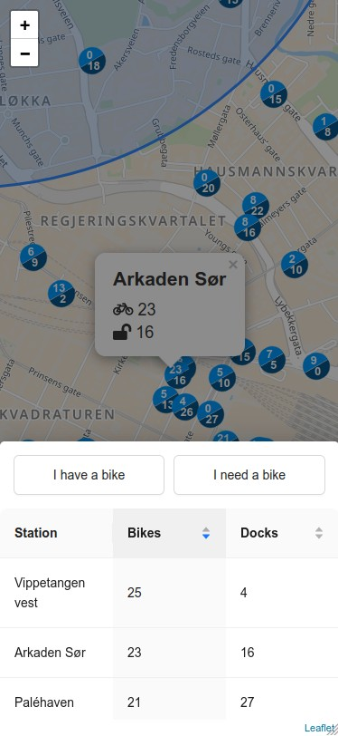

  

# hosted version / DEMO

https://juliannymark.com/apps/city-bike-viewer

# How to run

1. clone the project / download source.
1. run `npm i` (in project root)
1. run `npm run start`

# Features

- responsive (looks OK on desktop, looks a little better on mobile!)
- working map visualization + data fetching
  - [leafletjs](https://leafletjs.com/) used for the map
- show current location + centering, on load
- filtering on bikes available vs docks available 
  - usually you're interested in one of them, but not both, does not currently filter on the map, only in the table, es tut mir leid! (Why? used the tables own filtering functionality instead of my own filtering prior to feeding the data to both the table _and_ the map...)
- custom `marker` to be condensed and informative, showing number of bikes & docks available (reduce total clicks)
- auto-updating station information
  - fetch station information once on initial page load
  - fetch station status continuously (every 10 seconds, as suggested by server `max-age` http response header)
- filtering list, sortable, also tapping on rows will trigger `panTo()` of the map view.
  - slightly complex usage of [ant tables](https://ant.design/components/table)
- Low complexity / No central data store
  - the app is simple & small enough to not need it for now. So there's no Redux or usage of the react context API. It's all just prop passing for now! (plain React)

---

# Getting Started with Create React App

This project was bootstrapped with [Create React App](https://github.com/facebook/create-react-app).

## Available Scripts

In the project directory, you can run:

### `npm start`

Runs the app in the development mode.\
Open [http://localhost:3000](http://localhost:3000) to view it in the browser.

The page will reload if you make edits.\
You will also see any lint errors in the console.

### `npm test`

Launches the test runner in the interactive watch mode.\
See the section about [running tests](https://facebook.github.io/create-react-app/docs/running-tests) for more information.

### `npm run build`

Builds the app for production to the `build` folder.\
It correctly bundles React in production mode and optimizes the build for the best performance.

The build is minified and the filenames include the hashes.\
Your app is ready to be deployed!

See the section about [deployment](https://facebook.github.io/create-react-app/docs/deployment) for more information.

### `npm run eject`

**Note: this is a one-way operation. Once you `eject`, you can’t go back!**

If you aren’t satisfied with the build tool and configuration choices, you can `eject` at any time. This command will remove the single build dependency from your project.

Instead, it will copy all the configuration files and the transitive dependencies (webpack, Babel, ESLint, etc) right into your project so you have full control over them. All of the commands except `eject` will still work, but they will point to the copied scripts so you can tweak them. At this point you’re on your own.

You don’t have to ever use `eject`. The curated feature set is suitable for small and middle deployments, and you shouldn’t feel obligated to use this feature. However we understand that this tool wouldn’t be useful if you couldn’t customize it when you are ready for it.

## Learn More

You can learn more in the [Create React App documentation](https://facebook.github.io/create-react-app/docs/getting-started).

To learn React, check out the [React documentation](https://reactjs.org/).
